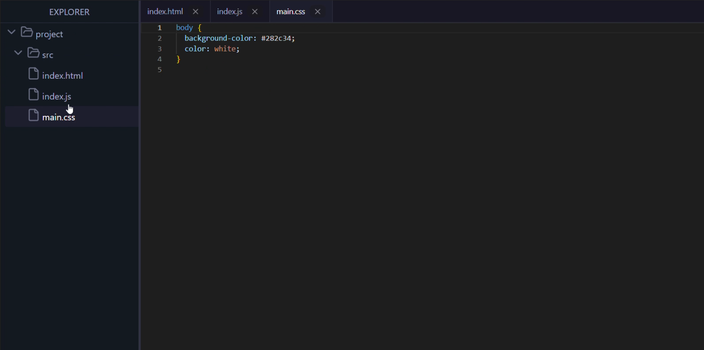

# File Surf

A React package that extends Monaco Editor with VS Code-like file explorer capabilities, allowing users to navigate through multiple files and folders with a familiar interface.

## Installation

```bash
npm install file-surf
# or
yarn add file-surf
```

Make sure you have the following peer dependencies installed:

- react
- react-dom

## Features

- Tree-view file explorer with folder collapsing/expanding
- Tab-based file navigation
- Multi-file editing with Monaco Editor
- File operations (create, read, update, delete)
- Animation for file changes to simulate typing/streaming



## Usage

```jsx
import { FileSurf, useFileSurf } from "file-surf";
import "file-surf/style.css";

function App() {
  const initialFiles = {
    name: "project",
    type: "folder",
    children: [
      {
        name: "src",
        type: "folder",
        children: [
          {
            name: "index.js",
            type: "file",
            content: "console.log('Hello World');",
          },
        ],
      },
    ],
  };

  const { files, addFile, updateFile, deleteFile } = useFileSurf(initialFiles);

  const handleAddFile = () => {
    try {
      addFile("project/src", {
        name: "newFile.js",
        type: "file",
        content: "// New file created\nconsole.log('Hello from new file!');",
      });
    } catch (error) {
      console.error("Error adding file:", error);
    }
  };

  const handleUpdateFile = () => {
    try {
      updateFile(
        "project/src/index.js",
        "// File updated!\nconsole.log('Updated!');"
      );
    } catch (error) {
      console.error("Error updating file:", error);
    }
  };

  const handleDeleteFile = () => {
    try {
      // Only delete if the index.js file exists
      if (files.has("project/src/index.js")) {
        deleteFile("project/src/index.js");
      } else {
        console.error("File does not exist");
      }
    } catch (error) {
      console.error("Error deleting file:", error);
    }
  };

  return (
    <div className="flex flex-col h-screen text-white">
      {/* Header with actions */}
      <div className="p-4 border-b border-explorer-border bg-explorer-background flex items-center space-x-4">
        <h1 className="text-xl font-medium flex-1">Dark File Explorer</h1>
        <div className="flex space-x-2">
          <button
            variant="secondary"
            className="hover:bg-secondary/90"
            onClick={handleAddFile}
          >
            Add File
          </button>
          <button
            variant="secondary"
            className="hover:bg-secondary/90"
            onClick={handleUpdateFile}
          >
            Update File
          </button>
          <button
            variant="destructive"
            className="hover:bg-destructive/90"
            onClick={handleDeleteFile}
          >
            Delete File
          </button>
        </div>
      </div>

      {/* File Explorer */}
      <div className="flex-grow overflow-hidden">
        <FileSurf files={files} width={"50vw"} />
      </div>
    </div>
  );
}

export default App;
```

## Props

### `FileSurf` Component

| Prop     | Type                       | Default    | Description                                   |
| -------- | -------------------------- | ---------- | --------------------------------------------- |
| `files`  | `FileNode`                 | _Required_ | JSON structure representing files and folders |
| `height` | `string \| number (in px)` | `100vh`    | Height of the component                       |
| `width`  | `string \| number (in px)` | `100vw`    | Width of the component                        |

## File System Structure

The `files` prop accepts a JSON structure where:

- The `name` key represents the name of the file or folder
- The `type` key indicates whether it is a `file` or `folder`
- The `children` key contains an array of files or folders within a folder
- The `content` key contains the content of a file

Example:

```javascript
{
    name: "project",
    type: "folder",
    children: [
      {
        name: "src",
        type: "folder",
        children: [
          { name: "index.js", type: "file", content: "console.log('Hello World');" }
        ]
      }
    ]
  }
```

## License

MIT
